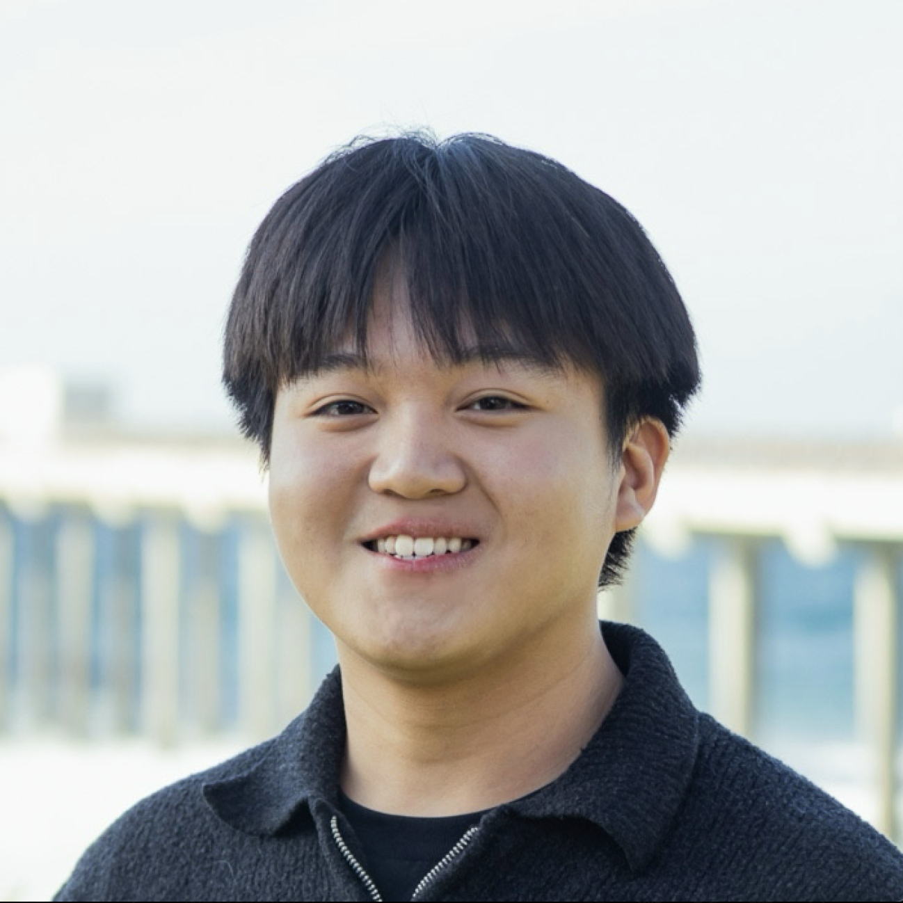

# Jordan Junaidi's Page

My name is **Jordan Junaidi**, and I'm a 2nd-year Computer Science student at UCSD! I'm originally from the Sacramento Area in Northern California and I'm interested in topics such as full-stack web development and AI/ML.

I'm proficient in:

- Python
- JavaScript/TypeScript
- HTML and CSS
- Java
- C
- C++
- Go.

I have experience developing full-stack web applications in both individual and team environments. I serve as an _Engineering Manager_ in the student org _Triton Software Engineering_, and I am excited to be working in Seattle this summer as a _Software Engineering Intern_ at _Adobe_!
